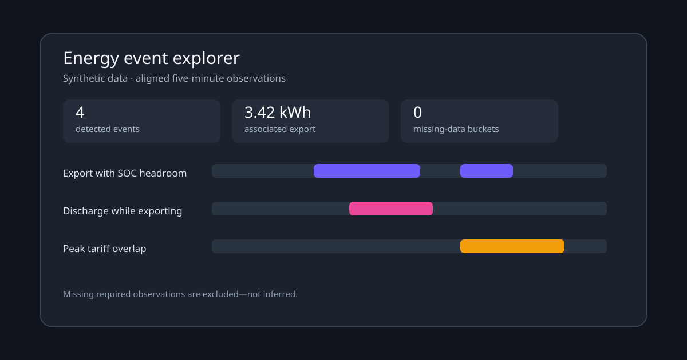

<p align="center">
  
</p>

# Energy Event Explorer Card

Home Assistant dashboard cards that show **when** configurable energy events
occurred, how long they lasted, and how much energy was associated with them.



The preview and example entity IDs use fictional data.

The project logo is original artwork. Its editable SVG source and 256/512-pixel
PNG exports are included under `assets/`.

## Included cards

- `custom:energy-event-range-selector-card` — a shared, local-time range selector with calendar-day navigation that preserves 23/25-hour DST days.
- `custom:energy-site-history-card` — continuous five-minute site/battery power history with dimensionally correct integrated kWh totals.
- `custom:energy-event-explorer-card` — configurable event timelines, durations, associated export energy, and explicit missing-data counts.

The cards accept ordinary Home Assistant entities and statistics. They are not tied to SolarEdge, Enphase, Tesla, Fronius, or any other provider.

## Installation

### HACS custom repository

1. In HACS, add this repository as a **Dashboard** custom repository.
2. Install **Energy Event Explorer Card**.
3. Add `/hacsfiles/energy-event-explorer-card/energy-event-explorer-card.js` as a JavaScript module if HACS does not add it automatically.
4. Refresh Home Assistant once after upgrading the resource.

### Manual

Copy `dist/energy-event-explorer-card.js` to Home Assistant's `www` directory and register `/local/energy-event-explorer-card.js` as a JavaScript module.

## Example

Use the same `range_key` on all three cards:

```yaml
type: vertical-stack
cards:
  - type: custom:energy-event-range-selector-card
    range_key: main-energy

  - type: custom:energy-site-history-card
    range_key: main-energy
    entities:
      solar: sensor.solar_power
      consumption: sensor.home_consumption_power
      grid_import: sensor.grid_import_power
      grid_export: sensor.grid_export_power
      battery_charge: sensor.battery_charge_power
      battery_discharge: sensor.battery_discharge_power
    series:
      - metric: solar
        label: Solar generation
        color: "#3b82f6"
      - metric: consumption
        label: Consumption
        color: "#ef4444"
      - metric: grid_export
        label: Grid export
        color: "#14b8a6"
      - metric: battery_discharge
        label: Battery discharge
        color: "#8b5cf6"

  - type: custom:energy-event-explorer-card
    range_key: main-energy
    entities:
      grid_export: sensor.grid_export_power
      battery_soc: sensor.battery_state_of_charge
      battery_discharge: sensor.battery_discharge_power
      battery_charge: sensor.battery_charge_power
      charge_limit: sensor.battery_charge_limit
      operating_plan:
        entity: sensor.battery_operating_plan
        source: history
      operating_plan_active:
        entity: binary_sensor.battery_plan_active
        source: history
      operating_plan_blocks:
        entity: sensor.battery_plan_blocks
        source: history
    rules:
      - id: export-headroom
        label: Export with SOC headroom
        type: export_soc_headroom
        soc_below: 90
        min_export_kw: 0.2
        color: "#6d5dfc"
      - id: discharge-export
        label: Battery discharge while exporting
        type: discharge_while_exporting
        min_export_kw: 0.2
        min_discharge_kw: 0.1
        color: "#ec4899"
      - id: undercharge
        label: Export while battery is under charge limit
        type: export_undercharge
        soc_below: 90
        max_charge_fraction: 0.75
      - id: scheduled-plan
        label: Scheduled operating plan active
        type: operating_plan
        plans: [time_of_use]
        active: true
        min_blocks: 1
      - id: peak-export
        label: Peak-window export
        type: tariff_overlap
        min_export_kw: 0.2
        tariff_windows:
          - start: "16:00"
            end: "21:00"
```

Replace every example entity with one from your installation. No entity is assumed by default.

## Entity descriptors

A mapping may be a statistic ID string or an object:

```yaml
operating_plan:
  entity: sensor.battery_operating_plan
  source: history
```

Use `source: statistics` (the default) for numeric sensors with recorder statistics. Use `source: history` for string/enum/binary operating-plan state. An optional `attribute` reads a history-state attribute.

The current release uses Home Assistant's five-minute recorder period. Every required metric must have an observation at the same bucket start. A missing required metric makes that bucket non-qualifying and increments the visible missing-data count.

## Rules

| Type | Required roles | Purpose |
|---|---|---|
| `export_soc_headroom` | `export`, `soc` | Export above a threshold while SOC is below a threshold. |
| `discharge_while_exporting` | `export`, `discharge` | Simultaneous battery discharge and grid export. |
| `export_undercharge` | `export`, `soc`, `charge`, `charge_limit` | Export with SOC headroom while charging is below a configured fraction of the observed limit. |
| `operating_plan` | `plan` | Match plan names plus optional active state and minimum block count. |
| `operating_plan_change` | `plan` | Mark plan-state transitions. |
| `tariff_overlap` | `export` | Export during configured daily windows, including overnight windows. |

Role names can be redirected per rule with `metrics`, for example `metrics: { export: inverter_export, soc: storage_soc }`.

Tariff windows may also be attached to any rule. They describe user-supplied clock windows; the card never guesses a tariff from provider, location, or thermostat schedules.

## Semantics and limitations

- Power series are continuous measured values in kW. Integrated event energy is `kW × observed bucket hours` and is displayed in kWh.
- Export, import, battery charge, and battery discharge must be separate non-negative series. Configure template sensors first if an integration exposes a signed net-flow entity.
- The card identifies measured correlations. It does not attribute intent, command actor, virtual-power-plant behavior, lost revenue, or equipment faults without corresponding evidence entities.
- Energy is reported per rule and per event. If rules overlap, the same physical export may appear in more than one rule; the card labels the cross-rule sum accordingly rather than presenting it as unique site energy.
- History values are aligned by exact timestamps. Missing values fail closed rather than being interpolated.
- The selected range is local-time based. Today keeps a midnight-to-midnight axis while querying only through the current time.

## Development

Requires Node.js 20 or newer and has no runtime or build dependencies.

```sh
npm ci
npm run validate
```

`npm run build` deterministically creates `dist/energy-event-explorer-card.js`. Commit the artifact; CI verifies that rebuilding it produces no diff.

## License

Apache License 2.0.
